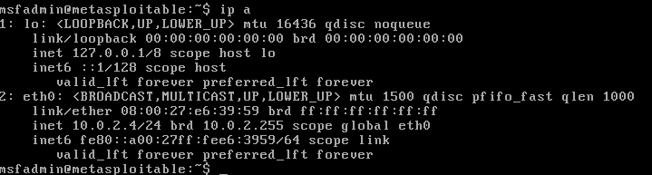
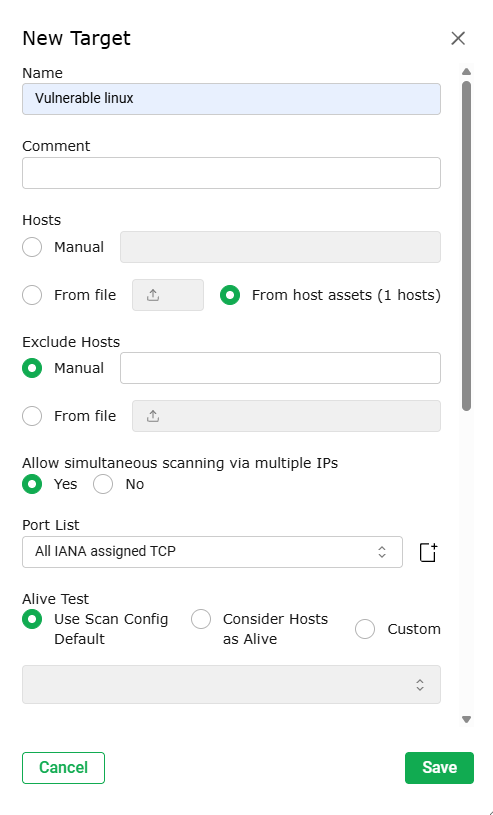
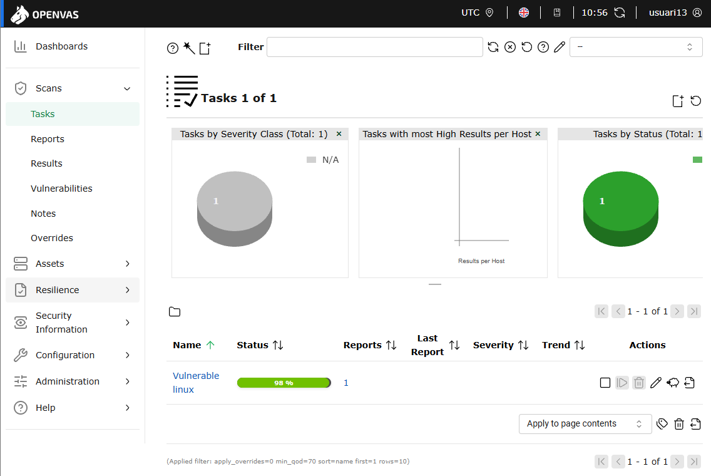
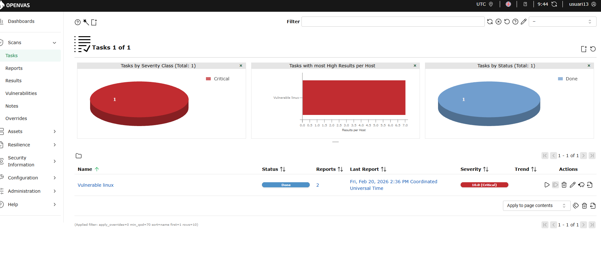
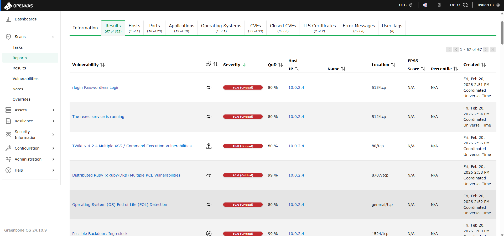
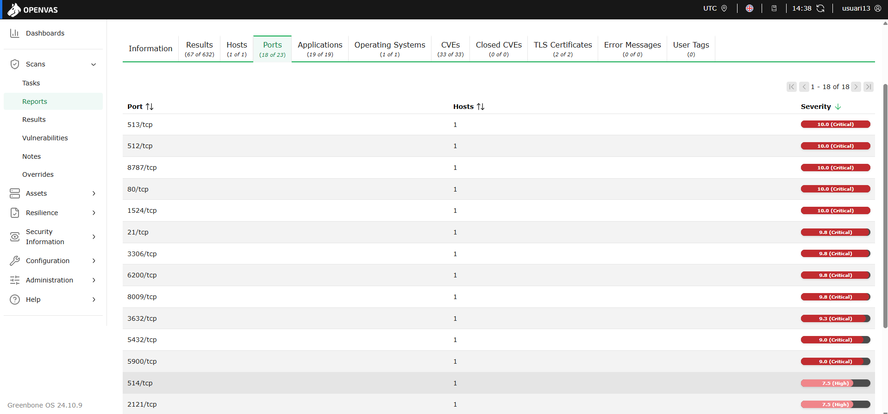

# T09: Seguretat: les vulnerabilitats dels sistemes
## Abdeslam Khfif Koubee
---

Primer de tot el que haurem de fer sera entrar a la maquina de metasploitable 

---

Aqui farem un ip a per veure la nostre ip 

---

Ara entrem a la maquina de OPENVAS i ficarem de usuari admin i de contrasenya admin 

---

Aqui ens portara a un menu despres de ficar el nostre usuari i la nostre contrasenya 

---

Ens sortira aquest menu amb tres opcions "yes", "no", "cancel". i li donarem al yes

---

Ens sortira un altre menu amb dues opcions "yes" i "no" i nosaltres li donarem a yes 

---

Ara ens demanara fer un nou admin i ficarem de nom de compte usuari i el nostre numero de llista en el meu cas es "usuari13" i de contrasenya usuari

---

Despres de ficar-ho tot li donarem a ok per avanzar a la seguent opció

---

I aqui ens avisara de que el usuari ja se ha creat correctament

---

Aqui ens demanara una clau de subscripció i nosaltres li donarem a skip perque no hen tenim cap

---

Aqui no tocarem res i li donarem a "OK" per a continuar 

---

Ara ens surten 4 opcions pero nosaltres entrarem a la primera que diu setup

---

Al entrar al menu de setup ens sortiran unes altres 6 opcions i entrarem a la segona opcio que diu "network"

---

Despres de entrar al network sortiran 6 opcions mes pero nosaltres entrarem a "interfaces"

---

Ara configurarem la interface eth0

---

Per configurar-ho correctament ficarem en enabled el IPv4 i el DHCP i sortirem 

---

Ara despres de configurar el eth0 configurarem el eth1

---

Veiem que tot esta en disabled

---

Però nosaltres tindrem que ficar en enabled el IPv4 i el DHCP i sortirem 

---

Ara tornarem a aquest menu que ara tindrem que entrar a la opció que diu "IP"

---

I despres de ficar en enabled el eth0 i el eth1 i veurem les nostres ip's 

---

Despres de fer tot ja tancarem la sesió ja que tot esta fet correcte 

---

Ara anirem a google i al buscador buscarem https://192.168.56.103 que es la ip que ens han donat anteriorment i iniciarem sesió 

---

Un cop dins anirem a la opció de "assets" i dins i ha una opció que es la de hosts i anirem a aquella opció

---

Al entrar a hosts farem una nova host i ficarem la ip que ens han donat a la maquina virtual anteriror la de metasploitable

---

Ara farem una nova target i de nom li ficarem un nom en el meu cas li he ficat vulnerable linux i guardarem 

---

Aqui ficarem la primera opció que diu "use scan config default" i a on fica SMB ficarem "mfsadmin" i guardarem 

---

Ara farem una nova tasca ficarem un nom el que vulguis en el meu cas Vulnerable linux i on fica "scan targets" triarem la target creada anteriorment

---

Aqui veiem que la tasca ja esta en proces

---

Ara veiem que la tasca ja ha acabat

---

Aqui veiem els resultats de la tasca 

---

I aqui veiem tots els ports de la nostre tasca 

---

